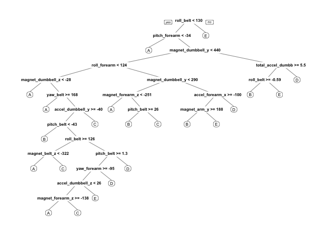
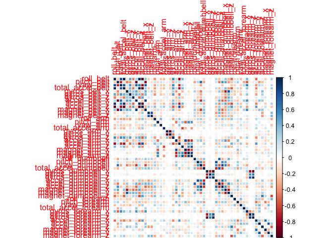

# Practical Machine Learning Course Project

Author: Norman Benbrahim

This code has been run on a Mac OSX (8 GB RAM, 256 GB SSD) running on Mavericks with R version 3.2.3 (Sunday February 7th 2015)

# The Problem Setting

The goal of your project is to predict the manner in which they did the exercise. This is the "classe" variable in the training set. You may use any of the other variables to predict with. You should create a report describing how you built your model, how you used cross validation, what you think the expected out of sample error is, and why you made the choices you did. You will also use your prediction model to predict 20 different test cases.

# Getting the Data Ready

First load the required packages

```r
library(caret)
library(rattle)
library(rpart)
library(rpart.plot)
library(RColorBrewer)
library(rattle)
library(randomForest)
library(corrplot)
```

Loading the data


```r
if (!file.exists("./data")) {
    dir.create("./data")
}

if (!file.exists('./data/pml-training.csv')) {
    download.file('https://d396qusza40orc.cloudfront.net/predmachlearn/pml-training.csv', 
                  destfile = './data/pml-training.csv')
}
if (!file.exists('./data/pml-testing.csv')) {
    download.file('https://d396qusza40orc.cloudfront.net/predmachlearn/pml-testing.csv', 
                  destfile = './data/pml-testing.csv')
}

training <- read.csv('./data/pml-training.csv', na.strings=c('NA','#DIV/0!',''))
testing <- read.csv('./data/pml-testing.csv', na.strings=c('NA','#DIV/0!',''))
```

Now let's remove the rows and columns with NAs, as there is a lot of data to work with so we can afford it


```r
training <- training[, colSums(is.na(training)) == 0] 
testing <- testing[, colSums(is.na(testing)) == 0] 
```

Now we're going to remove some of the data points that don't contribute much to accelerometer measurements 


```r
classe <- training$classe
train_remove <- grepl("^X|timestamp|window", names(training))
training <- training[, !train_remove]
train_clean <- training[, sapply(training, is.numeric)]
train_clean$classe <- classe
test_remove <- grepl("^X|timestamp|window", names(testing))
testing <- testing[, !test_remove]
test_clean <- testing[, sapply(testing, is.numeric)]

dim(test_clean)
```

```
## [1] 20 53
```

```r
dim(train_clean)
```

```
## [1] 19622    53
```

Let's split our training data into a train and validate set. This ensures we can validate our model on our validation set and make any final tweaks based on this. We will use 80% training, 20% validation.


```r
set.seed(12345)
inTrain <- createDataPartition(train_clean$classe, p=0.80, list=F)
training_data <- train_clean[inTrain, ]
validation_data <- train_clean[-inTrain, ]
```

# The Modeling

Here we fit a predictive model using random forests (with 5-fold cross validation) to select the classe variable. Random forests is robust to covariates and picks out the important features. Additionally it verifies if any of your features are strongly correlated and only uses the ones it thinks will have the most impact. If you are running this on your local machine, be sure to cache your results when you are tweaking your own parameters!


```r
control_rf <- trainControl(method='cv', 5)
# takes ~ 5 mins to run
model <- train(classe ~ ., data = training_data, method = 'rf', trControl=control_rf, ntree=250)
```

# The Validation

Let's estimate the performance on the validation set now


```r
prediction <- predict(model, validation_data)
confusionMatrix(validation_data$classe, prediction)
```

```
## Confusion Matrix and Statistics
## 
##           Reference
## Prediction    A    B    C    D    E
##          A 1115    1    0    0    0
##          B    6  752    1    0    0
##          C    0   10  674    0    0
##          D    0    0   15  628    0
##          E    0    0    0    2  719
## 
## Overall Statistics
##                                           
##                Accuracy : 0.9911          
##                  95% CI : (0.9876, 0.9938)
##     No Information Rate : 0.2858          
##     P-Value [Acc > NIR] : < 2.2e-16       
##                                           
##                   Kappa : 0.9887          
##  Mcnemar's Test P-Value : NA              
## 
## Statistics by Class:
## 
##                      Class: A Class: B Class: C Class: D Class: E
## Sensitivity            0.9946   0.9856   0.9768   0.9968   1.0000
## Specificity            0.9996   0.9978   0.9969   0.9954   0.9994
## Pos Pred Value         0.9991   0.9908   0.9854   0.9767   0.9972
## Neg Pred Value         0.9979   0.9965   0.9951   0.9994   1.0000
## Prevalence             0.2858   0.1945   0.1759   0.1606   0.1833
## Detection Rate         0.2842   0.1917   0.1718   0.1601   0.1833
## Detection Prevalence   0.2845   0.1935   0.1744   0.1639   0.1838
## Balanced Accuracy      0.9971   0.9917   0.9869   0.9961   0.9997
```

We get an accuracy of 99.1% and an estimated out of sample error of:


```r
1 - as.numeric(confusionMatrix(validation_data$classe, prediction)$overall[1])
```

```
## [1] 0.008921744
```

on the validation set. Let's try it out on the test data

# The Testing


```r
result <- predict(model, test_clean)
result
```

```
##  [1] B A B A A E D B A A B C B A E E A B B B
## Levels: A B C D E
```

# The Plots

First let's visualize the decision tree


```r
treemod <- rpart(classe ~ ., data = training_data, method = "class")
prp(treemod)
```

\

Now a correlation matrix


```r
p <- cor(training_data[, -length(names(training_data))])
corrplot(p, method="color")
```

\
